# Tech Environment Setup

## Introduction

This project is to document the tech-environment setup for Windows for machine to be used to run DevOps program so as to ensure that all the necessary tools and resources are downloaded and duly installed on the machine.

### 1. Installing Visual Studio Code (VScode)

Visual studio code (VS Code) is a powerful, lightweight and versatile code editor developed by Microsoft, designed for a wide of programming languages and development tasks. It offers features like IntelliSense for smart code completion, integrated Git support for seamless version control, and an in-built terminal for command-line operations. VS Code is fast, flexible and has robust features, making it a top choice among developers.

*Windows Installation*

* Download vscode from [VisualStudio website](https://code.visualstudio.com/)
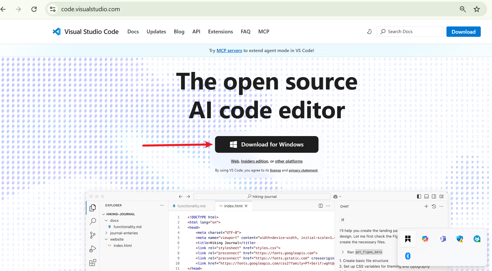
* Run the installer by locating the .exe file and double-clicking

* Go through the installation process by clicking NEXT till installation is complete
* After installation is complete, launch VScode by opening from Start Menu
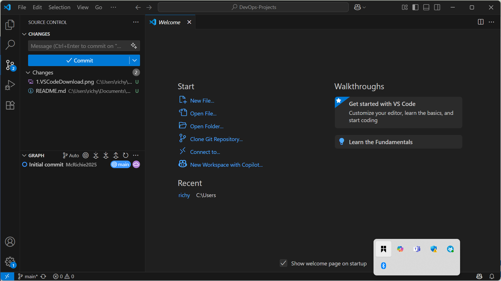

### 2. Installing Git
Git is a distributed version control software that tracks versions of files. It is often used to control source code by programmers who are developing software collaboratively.

*Windows Installation*

* Download Git from [Git website](https://git-scm.com/downloads)
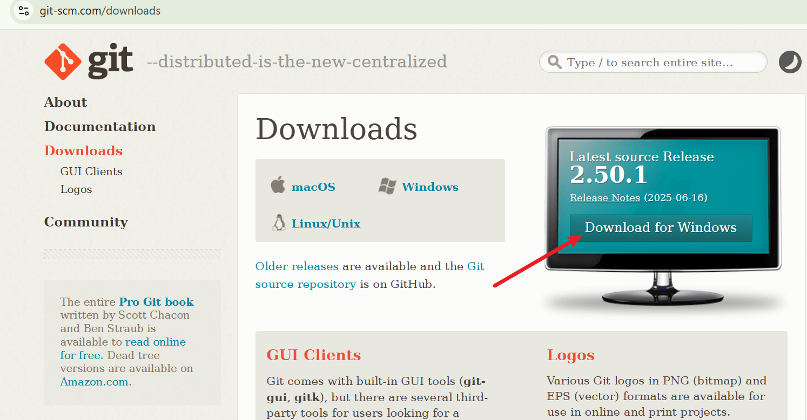
* Run the installation file 
* After installation is complete, launch Git by opening Git Bash from the Start Menu
* Test Git by checking the version installed. Type "git --version command" to display version
 

### 3. Installation of Virtual box 
VirtualBox is a general-purpose full virtualization software for x86_64 hardware, targeted at laptop, desktop, server and embedded use. It allows users to create and run virtual machines on their computers. This enables users to run multiple operating systems simultaneously, such as running Windows on a Linux machine, or vice versa, without needing separate physical computers.

*Windows Installation*
* Download Oracle virtualbox from [Virtualbox.org](https://www.virtualbox.org/wiki/Downloads)
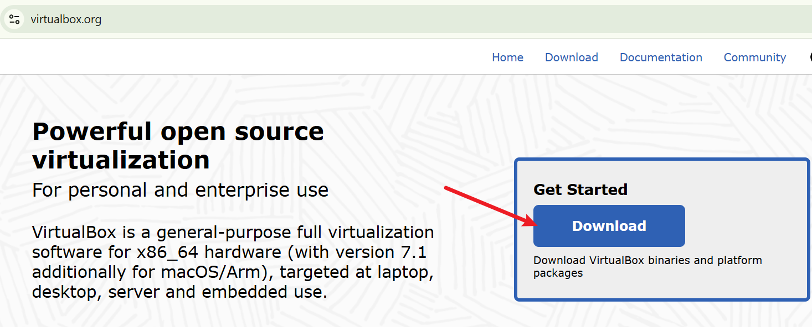
* Locate the .exe file and run the installer by double-clicking the executable file
* Complete the installation and launch the Oracle VM Virtual Box Manager from Start Menu

### 4. Installation of Ubuntu on Virtual box (Windows)
* Download Ubuntu (.iso) Desktop from [ubuntu.com](https://ubuntu.com/download/desktop)
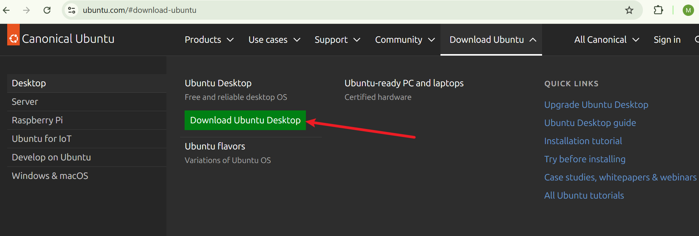
* Start the Oracle virtualbox and add new machine
* Name the new machine Ubuntu and complete the process
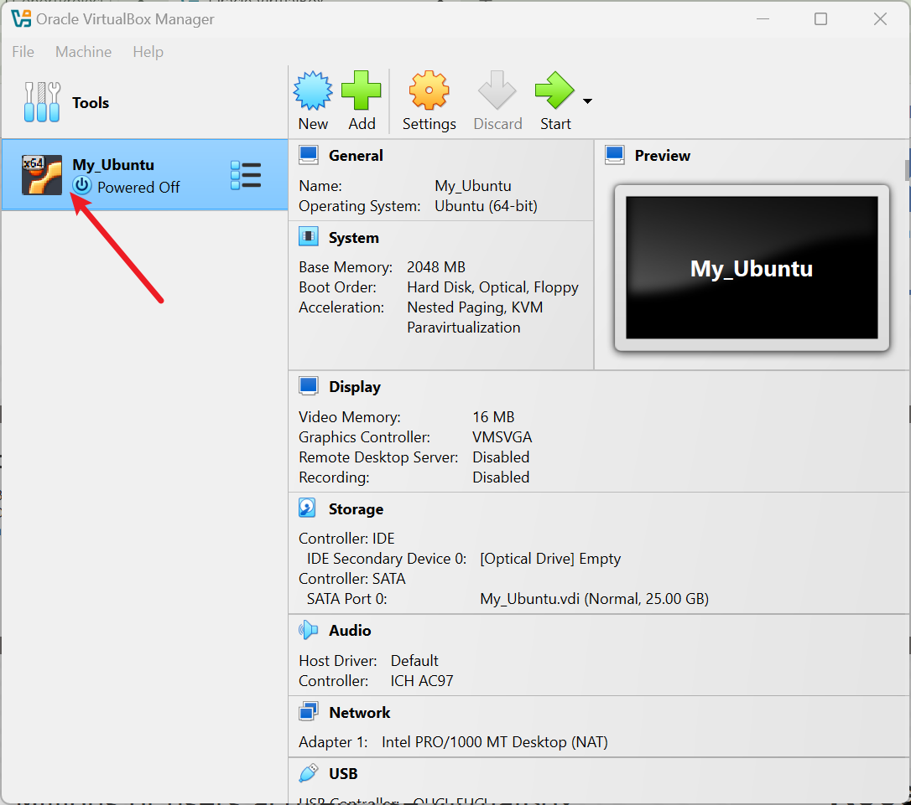
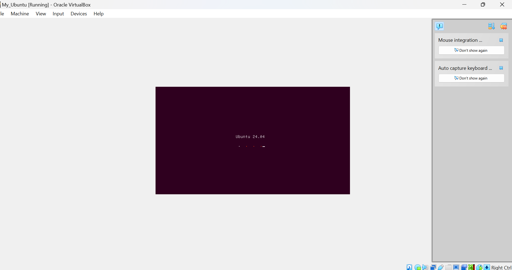
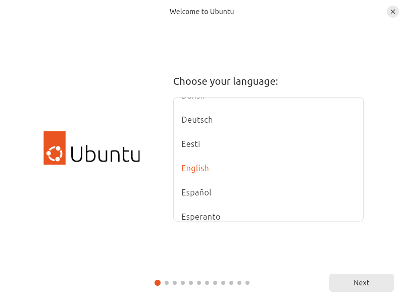
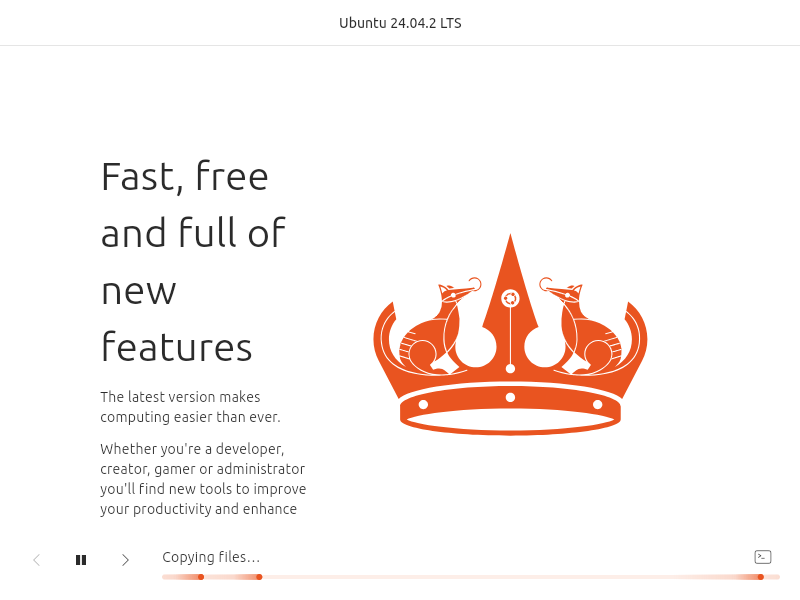

### 5. Creation of Github account

To create a GitHub account, visit the GitHub [sign up page](github.com/join).

#### Enter Your Details:
* Username: Choose a unique username.
* Email Address: Use a valid email address.
* Password: Create a secure password.
* Verify Your Account:
* Complete the puzzle to prove you're not a robot.
* Check your email inbox for a verification link and follow the instructions.
#### Setup Profile: 
Fill out your profile details, add a profile picture, and set your preferences (optional).
#### Start Using GitHub: 
You can now create repositories, follow other users, and collaborate on projects.
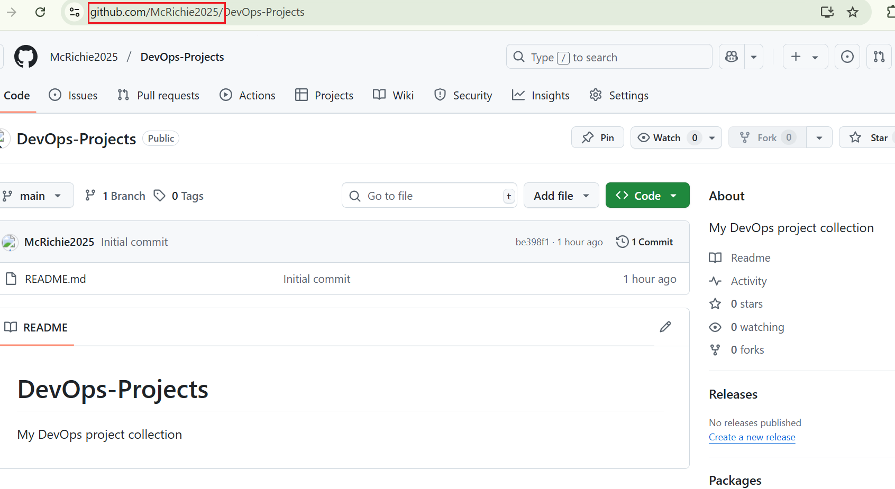

### 5. Creation of AWS account

* Go to the AWS Registration Page
Visit the official [AWS sign-up page](https://portal.aws.amazon.com/billing/signup)

* Enter Your Email and Choose an Account Name

* Provide a valid email address.
Choose a strong password and enter your AWS account name (this can be your company or personal name).

#### Contact Information

* Choose “Personal” or “Professional” account type.
Enter your full name, address, and phone number.

#### Payment Information

* Enter your credit/debit card details. AWS needs this for identity verification and billing (note: you’ll only be charged for resources you use beyond the free tier).

#### Identity Verification

* Enter the verification code sent to your phone via SMS or voice call.
* Select a Support Plan

You can start with the “Basic” support plan (free) and upgrade later if needed.

#### Sign In to the Console

* After successful registration and verification, sign in to the [AWS Management Console](https://aws.amazon.com/console/)
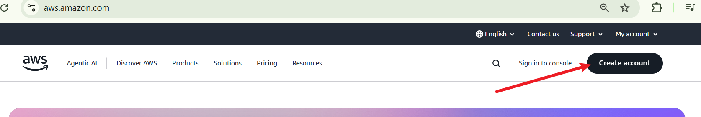